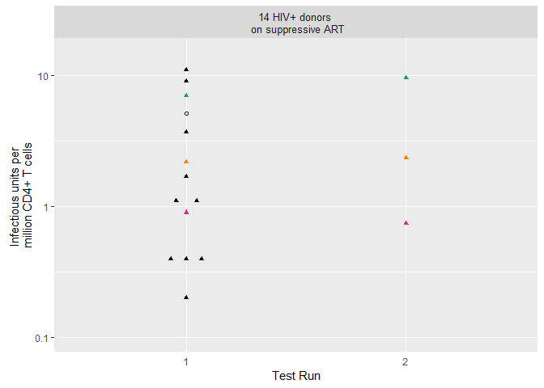
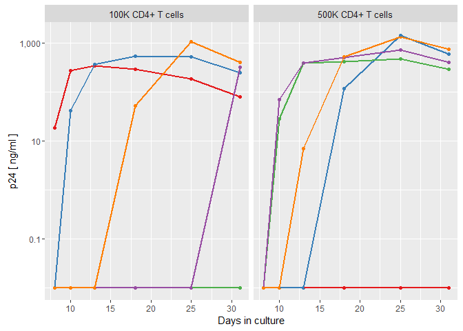

These are figures for the cure u01 grant application. We got the data from someone else, but their graph wasn't good so I am re-making it. They sent the data+graph+info all in one file so I took out just the data and put it in a .csv file to read into R.

The first figure is data from all donors

This is the data set with "representative viral growth" from one of the donors: AB9105. "input" is \# of CD4 cells, "p24" is ng/ml p24 from ELISA. if p24 = 0.01, it was below LOD.

